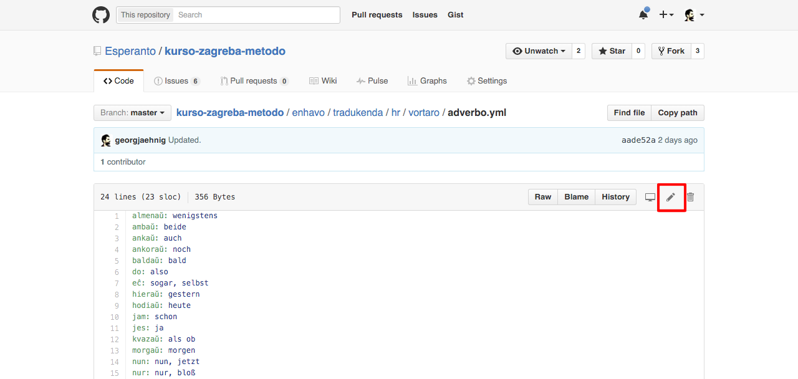

# Kiel traduki al nova lingvo

Saluton! Unue dankegon, ke vi volas traduki tiun ĉi kurson! Kiel fari tion.

## Kreu konton ĉe Github

1. bonvole iru al https://github.com/join kaj kreu (senpagan) personan konton.
2. Sendu vian uzantnomon al georg@jaehnig.org kaj skribu ankaŭ:
   - al kiu lingvo vi volas traduki
   - kiun jam ekzistantan, similan lingvon vi volas havi kiel ĝermo. (Normale, oni elektas la anglan. Sed se vi ekzemple volas traduki al la indonezia, indus elekti la similan malajan.)
3. Atendu mian respondon. :)

## Akceptu la inviton al la teamo

Kiam mi legis vian mesaĝon, mi invitas vin al la Esperanta teamo ĉe Github. Mi skribas al vi, kiam mi faris tion. Por akcepti la inviton

1. iru al https://github.com/Esperanto kaj klaku al "View invitation".
2. En la sekva paĝo, klaku al "Join Esperanto".

## Kontrolu ĉu traduko al via lingvo jam ekzistas

La [Zagreba metodo](https://eo.wikipedia.org/wiki/Zagreba_metodo) estas jam tradukita al multe da lingvoj, tial plej bonus se vi ne mem tradukas al via lingvo sed trovas tradukaĵon al tiu lingvo.  

La tradukaĵoj ĝis nun nur eldonitas en libra formo. Kelkajn skanaĵojn troviĝas:

- en la dosierujo [materialo](materialo)
- en aliaj retpaĝoj:
	- [angla](http://esperantofre.com/zagreb/zagreba.htm)
	- [bulgara](https://drive.google.com/open?id=0B73-tppgbUreWE9Pakk3X3YtajA)
	- [finna](https://drive.google.com/open?id=0B73-tppgbUreUmhjOXhfRjROTms)
	- [hispana](http://esperantofre.com/zagreb/zagrebh.htm)
	- [itala](https://drive.google.com/open?id=0B73-tppgbUreZ3dxUVB5QWFTMGs)
	- [korea](https://drive.google.com/open?id=0B73-tppgbUreRGVKUXJqSzUwaVU)
	- [kroata](https://drive.google.com/open?id=0B73-tppgbUrecVZxc21TQ2syUzQ), [alia versio](https://drive.google.com/open?id=0B73-tppgbUreU2tGMEFWR0pCblU)
	- [makedona (nekompleta)](https://drive.google.com/open?id=0B73-tppgbUreZVRhTUVQWjMtYlU)
	- [pola](https://drive.google.com/open?id=0B73-tppgbUreU2tGMEFWR0pCblU)
	- [rumana](https://drive.google.com/open?id=0B73-tppgbUreN19waV84ZnFwd0E)
	- [slovaka](https://drive.google.com/open?id=0B73-tppgbUreTGdWT19JQ09jamM)
	- [vjetnama](https://drive.google.com/open?id=0B73-tppgbUreYjBObFBhcHZROTg)

(Se vi havas pli da skanaĵojn, bonvole aldonu ilin aŭ [informu min](mailto:georg@jaehnig.org)!)

## Tradukado

Nun ek al la tradukado!

### Ĝenerale: kiel redakti

1. Bonvole iru al la dosierujo kiun mi kreis por la nova lingvo. (Mi sendis la ligilon en mia retpoŝto al vi.)
2. Eniru la dosierujon kaj malfermu dosieron kiun vi volas traduki (simple klaku al ĝi).
3. Redaktu la dosierojn: Klaku al la redaktu-butono:

### Ekzercoj

Plej bonas komenci kun la ekzercoj:

#### Ekzerco 1 

1. Iru al `/ekzercoj/traduku` kaj malfermu `01.yml`. Nun vi vidas la fontdosieron de la [unua ekzerco](http://learn.esperanto.com/en/01/ekzerco1/)
2. Traduku nun la Esperantajn vortojn al la nova lingvo:
   - Forigo la anglajn vortojn
   - en ilia loko, entajpu la vortojn de la nova lingvo

Se via nova lingvo havas nur 1 tradukaĵo, skribu unu linion, ekzemple:

    - enskribi: to register

Se via nova lingvo havas pli ol 1 tradukaĵo, skribu pli da liniojn, ekzemple:

    - enskribi: 
      - to register
      - to inscribe

Finfine, klaku al "Commit changes" sube por konservi viajn ŝanĝojn.

Same, traduku la aliajn dosierojn en `/ekzercoj/traduku`. Bonas se vi ĉiam skribas multajn eblajn tradukaĵojn per vorto. Tiel ĉiuj eblaj respondoj de la estontaj lernantoj ĝustos.

#### Vortaro 

Same, traduku ĉiujn dosierojn en `/vortaro`.

#### Ekzerco 3

En `/ekzercoj/traduku-kaj-respondu`, ni tradukas la [trian ekzercon](http://learn.esperanto.com/en/01/ekzerco3/). Por ĉiu traduko, vi vidas 2 linojn:

    demando:
    rektatraduko:

En la linio `demando:`, skribu bonsonan frazon en via lingvo, ekzemple:

    demando: Does friendship make you more happy than love does?

En la linio `rektatraduko:`, skribu laŭvortan tradukon en via lingvo. Ĝi ne devas esti bonsona aŭ eĉ gramatike ĝusta. Ĝi nur celas informi la lernanton kiujn Esperantajn vortojn li aŭ ŝi uzu.  Ekzemple:

    rektatraduko: 
      - Ĉu: Whether
      - amikeco: friendship
      - pli: more
      - feliĉigas: makes happy
      - vin: you
      - ol: than
      - la: the
      - amo: love
      - '?'
Tre bonas uzi la samajn vortojn kiel en viaj tradukoj en `/vortaro`. Sed rimarku ke tie oni bezonas __nur unu__ tradukaĵon per vorto.

Se via lingvo tute ne havas laŭvortan tradukon de kelkaj Esperantaj vortoj, skribu ian klarigon. Ekzemple, se la angla ne havus la vorton "the", oni povus skribi

      - la: (definite article)

Denove: La celo estas ke la lernanto sciu kion skribu.

#### Se iu traduko ne aperas

Foje vi devas uzi citolojn, ekzemple jen:

    vorto: "on"

Ĉar `on` estas angla vorto, la dosierformato ne komprenas ĝin kiel ĉeno (string), sed kiel buleo (boolean) kaj penas ke signifas `TRUE`. Tial vi devas uzi citilojn: `"on"`.

Alia ekzemplo:

    vorto: "apostrophe's translation"

Se vi uzas citilojn en la tradukaĵo, uzu aliajn citilojn ĉirkaŭe.

### Gramatiko

La gramatikaj klarigoj estas en la dosierujo `/gramatiko`. Ili skribitas en [Markdown](https://en.wikipedia.org/wiki/Markdown). 

- Por ĉiu leciono, kreu dosieron laŭ la leciona indekso. Ekzemple:
  -  `01.md` - Klarigo pri leciono 1
  -  `02.md` - Klarigo pri leciono 2
  - ktp.
- Skribu ĉion Esperanton uzante `*`, ekzemple
  - `*bona lingvo*`
- Disigu Esperanto kaj la tradukon per `–` (dash), ne per `-`. Ekzemple:
  - `*bona lingvo* – good language`
- Skribu vortojn aŭ literojn pri kiuj vi nun klarigas uzante `__`. Ekzemple:
  - `The morpheme *-ej* denotes a place, for example *lern__ej__o* – school`
- se vi dubas, rigardu la [germanan version](de/)

Ne timu se Github kelkfoje malĝuste transigas partojn de Markdown (ekz. kombinadojn kiel `*lern__ej__o*`), montrante la Markdown-dosierojn en sia retejo. Tio nur estas problemo de Github, nia kreanta skripto tamen bone tradukos ilin.
